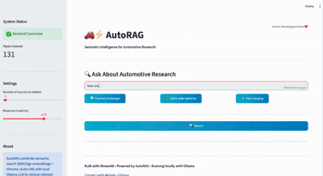

# AutoRAG: Semantic Intelligence for Automotive Research

 Retrieval-Augmented Generation system for analyzing 
automotive and electric vehicle research papers.Then uses local Ollama mistral to synthesize intelligent, cited answers to your technical questions.

**Ask intelligent questions. Get grounded answers with citations.**

## What It Does

- Ingests automotive research PDFs
- Generates semantic embeddings (BAAI/bge-large)
- Performs hybrid retrieval (semantic + keyword search)
- Get synthesize grounded answers
- Cites sources with paper references



## To Test
### Ingest papers

```bash
python scripts/ingest_all.py
```
### Query system locally

```bash
python scripts/query.py "How is battery degradation managed based on emission?
```

### Run the Application

#### 1. Start the Backend API

```bash
python backend/main.py
```

#### 2. Start the Streamlit UI

```bash
streamlit run streamlit_app.py
```

